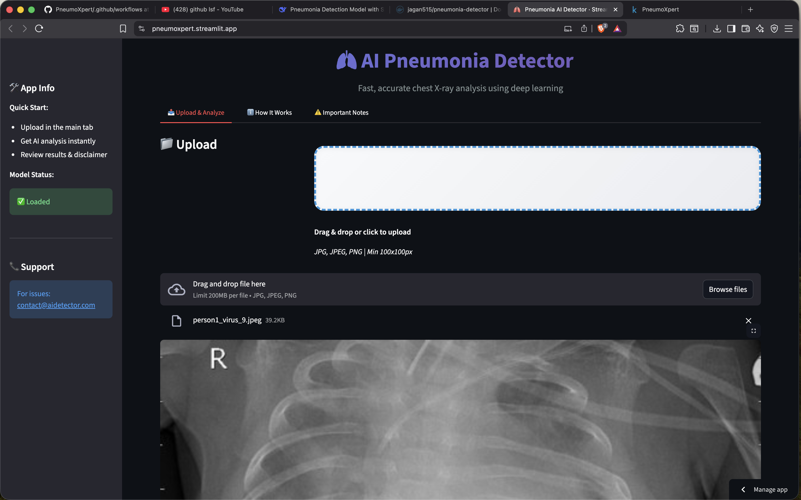
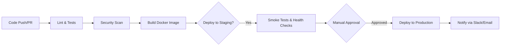

# 🫁 PneumoXpert

[](#)
[](#)
[](#)
[](https://opensource.org/licenses/MIT)
[](https://www.python.org/downloads/)
[](https://streamlit.io)

PneumoXpert is an intelligent web application for detecting pneumonia from chest X-ray images using deep learning. This project provides a complete end-to-end solution, including model training (with Kaggle integration), a user-friendly [Streamlit](https://streamlit.io/gallery?search=pneumoxpert) interface, Docker containerization, automated CI/CD via GitHub Actions, and planned monitoring capabilities. Built for healthcare screening assistance, it emphasizes accuracy, scalability, and security. Deployed via Streamlit Sharing for easy access.


##  Quick Access Links

| Resource | Link |
|----------|------|
|  **Live Streamlit App** | [Open PneumoXpert](https://pneumoxpert.streamlit.app/) |
|  **Kaggle Notebook** | [PneumoXpert Training Notebook](https://www.kaggle.com/code/jaganpradhan0/pneumoxpert) |
|  **DockerHub Image** | [jagan515/pneumonia-detector](https://hub.docker.com/repository/docker/jagan515/pneumonia-detector/general) |


##  Features

###  AI Capabilities
- **High Accuracy**: Achieves ~94% accuracy on the Chest X-Ray Pneumonia dataset test set.
- **Fast Analysis**: Delivers predictions in under 2 seconds per image.
- **Deep Learning Model**: Custom CNN with 4 convolutional blocks (64→128→256→512 filters), batch normalization, dropout, and sigmoid output for binary classification (Normal vs. Pneumonia).
- **Confidence Scoring**: Displays prediction probabilities with visual meters.
- **Data Augmentation**: Built-in training augmentations (rotation, shifts, flips, brightness) for robustness.
- **Demo Mode**: Falls back to sample predictions if no model is loaded.

###  User Experience
- **Intuitive Interface**: Clean, minimalist Streamlit UI for image uploads and results.
- **Responsive Design**: Optimized for desktop, tablet, and mobile.
- **Real-time Feedback**: Progress bars during inference and validation.
- **Supported Formats**: JPG, JPEG, PNG; automatic X-ray image validation.
- **Batch Processing**: Handle multiple images in one session.

###  Technical Excellence
- **Kaggle Integration**: Train models on GPU-accelerated Kaggle notebooks using the provided script ([Notebook Demo](https://www.kaggle.com/code/jagan515/pneumonia-detection-training)).
- **Complete CI/CD**: Automated testing, Docker builds, and pushes to [Docker Hub](https://hub.docker.com/r/jagan515/pneumoxpert) on every commit/PR.
- **Dockerized Deployment**: Multi-platform support (x86_64 & ARM64) for easy local/cloud setup.
- **Monitoring**: Planned Prometheus + Grafana integration for metrics (uptime, inference time, errors) as part of future enhancements.
- **Security**: Vulnerability scanning, secret management, and input sanitization.
- **Scalability**: Designed for load balancing and high availability.


##  Prerequisites
- **Docker** & **Docker Compose** (for containerized runs).
- **Python 3.9+** (for local development or training).
- **Git** (for cloning and contributing).
- **4GB+ RAM** (recommended; GPU optional for training/inference).
- **Kaggle Account** (for GPU-accelerated training; optional).

Install dependencies locally:
```bash
pip install -r requirements.txt
```

## 🛠️ Quick Start

### Method 1: Docker (Recommended for Production)
Pull the pre-built image from Docker Hub:
```bash
# Pull from Docker Hub
docker pull jagan515/pneumoxpert:latest

# Run the container
docker run -p 8501:8501 jagan515/pneumoxpert:latest
```

Access the app at [http://localhost:8501](http://localhost:8501).

#### Using Docker Compose (Multi-Service Setup)
```bash
git clone https://github.com/jagan515/PneumoXpert.git
cd PneumoXpert
docker-compose up --build
```
This starts the app, optional monitoring (Prometheus/Grafana), and Redis for caching.

### Method 2: Local Development
```bash
# Clone the repository
git clone https://github.com/jagan515/PneumoXpert.git
cd PneumoXpert

# Create and activate virtual environment
python -m venv venv
source venv/bin/activate  # On Windows: venv\Scripts\activate

# Install dependencies
pip install -r requirements.txt

# Create directories for models and assets
mkdir -p models assets

# Run the Streamlit app
streamlit run app.py
```

##  Project Structure
Based on the repository layout:

```
PneumoXpert/
├── .github/workflows/          # CI/CD GitHub Actions (ci-cd.yml, docker-build.yml, security-scan.yml)
├── kaggle/                     # Kaggle-specific scripts and notebooks
│   └── kaggle_training.py      # GPU-accelerated training script for Chest X-Ray dataset
├── models/                     # Trained model artifacts (e.g., pneumonia_model_final.h5)
├── src/                        # Source code modules (e.g., model building, utils)
├── tests/                      # Unit/integration tests and checkpoints
├── .dockerignore               # Files to exclude from Docker builds
├── .gitattributes              # Git attributes for line endings
├── .gitignore                  # Git ignore patterns
├── Dockerfile.txt              # Dockerfile for building the app image (rename to Dockerfile if needed)
├── all-requirements.txt        # Combined dependencies for all environments
├── app.py                      # Main Streamlit application entrypoint
├── docker-compose.yml          # Docker Compose for local/multi-service setup
├── requirements.txt            # Core Python dependencies (Streamlit, TensorFlow, etc.)
├── test_model.py               # Script for testing/evaluating the trained model
├── train_model.py              # Local model training script
└── README.md                   # This file
```

## CI/CD Pipeline
Automated via GitHub Actions for reliability:

### Key Workflows
1. **CI (Continuous Integration)**: Triggers on push/PR – lints code (Black/Flake8), runs tests (pytest), scans security (Bandit/Trivy), builds Docker image.
2. **CD (Continuous Deployment)**: On main merge – logs into Docker Hub, pushes image, deploys to staging/prod (with manual approval).
3. **Security Scanning**: Weekly runs for vulnerabilities in deps/code/images.

### Pipeline Flow



Secrets (e.g., `DOCKER_USERNAME`, `DOCKER_PASSWORD`) stored in GitHub repo settings.

##  Docker Deployment

### Production Setup
```bash
# Use production compose (if available) or standard
docker-compose -f docker-compose.yml up -d

# Scale for load
docker-compose up -d --scale app=3

# Logs
docker-compose logs -f app
```

### Environment Configuration
Create `.env`:
```
ENVIRONMENT=production
MODEL_PATH=/app/models/pneumonia_model_final.h5
PORT=8501
MAX_UPLOAD_SIZE=10MB
LOG_LEVEL=INFO
```

### Monitoring Stack (Future Integration)
As part of upcoming enhancements, integrate Prometheus + Grafana for comprehensive observability:
```bash
docker-compose -f docker-compose.monitor.yml up -d
```
- Grafana: [http://localhost:3000](http://localhost:3000) (admin/admin)
- Prometheus: [http://localhost:9090](http://localhost:9090)

Track metrics like inference latency, error rates, and resource usage. Dashboard JSON available in the repo for quick import.

##  Model Training

### Local Training
```bash
# Install extra deps if needed
pip install tensorflow scikit-learn matplotlib seaborn joblib

# Run training
python train_model.py

# With args
python train_model.py --epochs 50 --batch-size 32 --learning-rate 0.0001
```

### Kaggle Training (GPU Recommended)
1. Create a Kaggle Notebook, add the [Chest X-Ray Images (Pneumonia)](https://www.kaggle.com/paultimothymooney/chest-xray-pneumonia) dataset.
2. Copy `kaggle/kaggle_training.py` into the notebook ([Example Notebook](https://www.kaggle.com/code/jagan515/pneumonia-detection-training)).
3. Enable GPU accelerator.
4. Run the script – outputs models to `/kaggle/working/models/` (download via Kaggle UI).
5. Metrics: ~90-95% accuracy, 0.97 AUC on test set.

Model outputs: `pneumonia_model_final.h5`, `pneumonia_pipeline.pkl`, evaluation plots.

##  Monitoring & Observability (Future Integration)
- **Health Checks**: `./scripts/health-check.sh` (if scripts/ exists) or `curl http://localhost:8501/_stcore/health`.
- **Metrics**: App uptime, response time, model inference latency, error rates.
- **Dashboards**: Upcoming Prometheus/Grafana integration for visual insights, with pre-built panels for prediction metrics and container health.
- **Next Steps**: Enable via `docker-compose.monitor.yml` for real-time alerting on latency spikes or high error rates.

##  Testing
```bash
# All tests
make test  # Or pytest tests/ -v

# Coverage
pytest --cov

# Specific: unit, integration, performance
pytest tests/unit/ -v
```

Coverage includes model eval, UI interactions, security checks.

##  Security
- **Scans**: Automated via CI (Trivy for images, Safety for deps).
- **Best Practices**: Non-root containers, env var secrets, image validation.
- **Commands**:
  ```bash
  make security-check
  trivy image jagan515/pneumoxpert:latest
  ```

##  Performance Optimization
- **GPU Inference**: `docker run --gpus all ...`
- **Caching**: Add Redis via Compose for sessions.
- **Scaling**: Use load balancers (e.g., Nginx) and multiple replicas.
- **Tips**: Resize images to 224x224, batch predictions.

##  Contributing
1. Fork the repo.
2. Create branch: `git checkout -b feature/your-feature`.
3. Commit: `git commit -m "Add your feature"`.
4. Push & PR: `git push origin feature/your-feature`.
5. Follow PEP 8, add tests/docstrings.

Pre-commit hooks: `pre-commit install`.

##  Medical Disclaimer
**CRITICAL**: PneumoXpert is for **educational/research/screening assistance ONLY**. It is **NOT** a medical device or substitute for professional diagnosis/treatment.

- **Limitations**: Possible false positives/negatives; dataset-specific biases.
- **Usage**: Consult doctors for real cases; do not self-diagnose.
- **Emergencies**: Seek immediate medical help.

##  License
MIT License – see [LICENSE](LICENSE) (add if missing).

##  Acknowledgments
- Dataset: [Chest X-Ray Images (Pneumonia)](https://www.kaggle.com/paultimothymooney/chest-xray-pneumonia).
- Tech: TensorFlow, Streamlit, Docker, GitHub Actions.
- Community: Kaggle forums, open-source contributors.

##  Support
- **Docs**: This README & code comments.
- **Issues**: [GitHub Issues](https://github.com/jagan515/PneumoXpert/issues).
- **Discussions**: [GitHub Discussions](https://github.com/jagan515/PneumoXpert/discussions).
- **Email**: For urgent, contact via GitHub profile.

Common Fixes:
| Issue | Solution |
|-------|----------|
| Model load fail | Ensure `models/` has `.h5` file; check paths in `.env`. |
| Port conflict | Edit `PORT` in `.env` or Compose. |
| Docker build slow | Use `--platform linux/amd64` for cross-build. |
| Low accuracy | Retrain on Kaggle with more epochs. |

---

<div align="center">
  <p>Built with ❤️ for accessible healthcare AI | Last Updated: December 07, 2025</p>
  <p>⭐ Star on GitHub if helpful!</p>
</div>